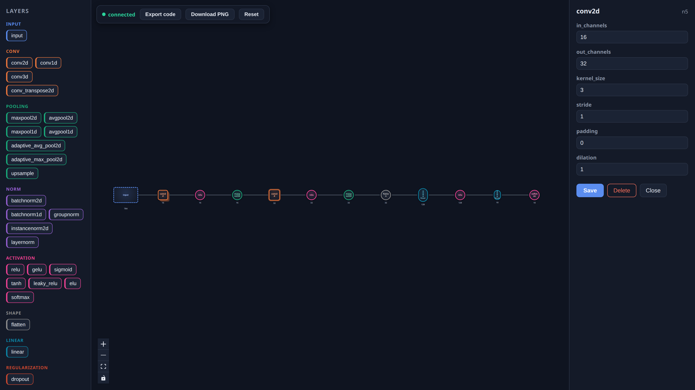
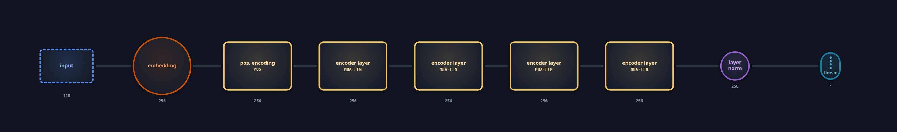
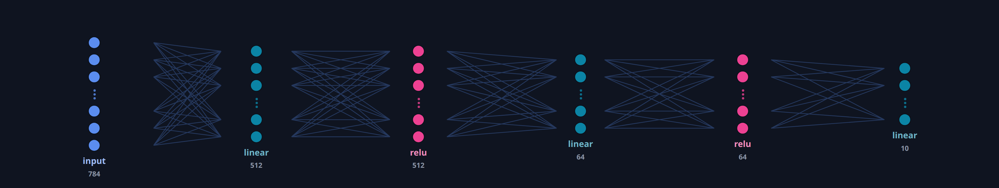
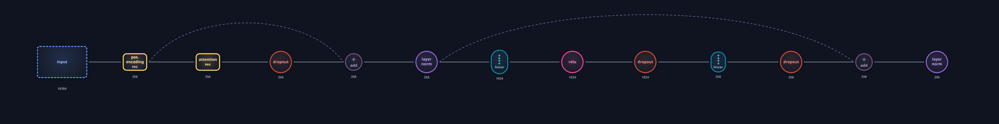
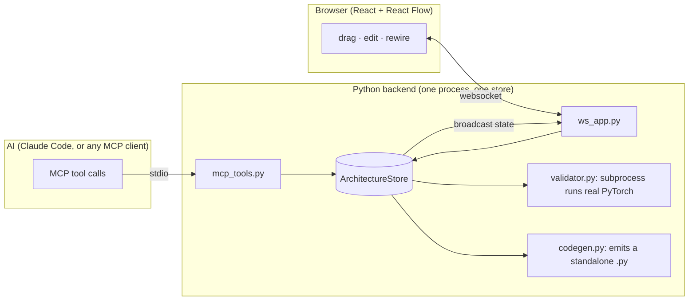

<div align="center">

# 🧠 nn-architect

### Build neural networks together with an AI, live in your browser

A local tool for designing neural networks with an AI. The AI builds the network by
calling tools; it renders on a canvas in your browser as it goes, so you can see exactly
what architecture the AI is writing code for. You can edit the same graph and hand control
back. Shapes are checked by running the generated PyTorch, not by reading it.

<p>
  
  
  
  
  
</p>

<a href="#quick-start"><b>Quick start</b></a> ·
<a href="#see-inside-composite-layers">Expand &amp; Ungroup</a> ·
<a href="#how-it-works">How it works</a> ·
<a href="#validation-by-execution">Validation</a> ·
<a href="#the-agents-tools">Tools</a> ·
<a href="#layer-catalog">Catalog</a>

</div>

---

**nn-architect is not another drag-and-drop "export to PyTorch" toy.** The point is a
graph you and an AI share, and a validator that proves shapes line up by executing real
code, not by reading it.

## Highlights

- 🤝 &nbsp;**One graph, you and the AI.** The tools the AI calls and the browser canvas are
  two views of a single shared graph, so what the AI builds is exactly what you see, and
  your edits are exactly what the AI reads back on its next look.
- 🔬 &nbsp;**Validation by execution.** `validate_architecture` generates a real PyTorch
  module, runs it against a dummy batch, and returns the exact node and layer where the
  shapes break, as a structured result rather than a traceback.
- 📦 &nbsp;**Standalone codegen.** `generate_code` emits one self-contained file that imports
  only `torch` and `math`. Drop it in a fresh `.py` outside the repo and it runs.
- 🧠 &nbsp;**Built for a cold agent.** A `get_catalog` discovery tool, errors written to be
  acted on (an unknown type lists the valid ones; a missing param names them all at once),
  and atomic batch builds so a 100-node model isn't hundreds of round-trips.
- 🔍 &nbsp;**Composites open up.** Expand is a read-only view: transformers and stacked RNNs
  unfold into their internals, and dense layers draw as the classic neuron diagram. Ungroup
  goes further and swaps a composite for its real, editable sub-layers, correctly rewired.

---

## Demo

> Ask for *"a small CNN for 28×28 grayscale digits,"* and the layers land on the canvas as
> the tool calls go out. Drag a node, change `out_channels`, delete an edge, and the AI
> picks it up on its next `get_architecture`. Either side can hand control back to the other.

<div align="center">
  
</div>

---

## Examples

A few architectures built on the canvas (these are the tool's own PNG exports):

<div align="center">
  
  <br/>
  <sub>A dense autoencoder: compresses down to an 8-unit latent, then reconstructs.</sub>
</div>

<br/>

<div align="center">
  
  <br/>
  <sub>A residual block: the skip connection arcs over both conv/norm pairs into an <code>add</code>.</sub>
</div>

<br/>

<div align="center">
  
  <br/>
  <sub>An encoder-only transformer: embedding → positional encoding → four encoder layers → norm → head.</sub>
</div>

---

## See inside composite layers

A `transformer_encoder_layer` is one node on the canvas, but it does not have to stay opaque.
Two features open it up, one shallow and one deep:

**Expand** is a read-only x-ray. Composite blocks unfold into their internal wiring, and
per-neuron layers render as the classic deep-net diagram, so a network's silhouette reads at
a glance. Columns are sampled to stay legible (a `⋮` marks the omitted middle), and every
connection line still lands on a real circle. Toggle it off and nothing has changed.

<div align="center">
  
  <br/>
  <sub>A 784-512-64-10 MLP in the expanded view, tapering like the classic textbook figure.</sub>
</div>

**Ungroup** makes it real. The composite is replaced in the shared graph by its actual
sub-layers: self-attention, the residual adds, the norms, the feed-forward pair, every edge
correctly rewired and every node fully editable. Delete a residual, retune the feed-forward
width, revalidate. It is a store mutation like any other, so the AI can do it too
(`ungroup_layer`), and it works on transformer encoder layers and on stacked or
bidirectional RNNs.

<div align="center">
  
  <br/>
  <sub>The transformer block from the gallery, ungrouped: both residual skips arc over their sub-chains.</sub>
</div>

---

## How it works

The backend runs as one process. An MCP client launches it over stdio; the same process
serves the websocket that the browser connects to. Both sides talk to a single in-memory
store, so there is no second code path that can mutate the graph: every successful edit,
from either side, broadcasts the new state to every connected browser.



---

## Validation by execution

Shapes are checked by running the code, not reading it. `validate_architecture` generates a
self-contained module, runs it in a subprocess against a fixed dummy batch (`N=2`), and
catches the failure at the layer that raised it:

```json
{
  "valid": false,
  "error": {
    "node_id": "n2",
    "layer_type": "conv2d",
    "message": "Given groups=1, weight of size [16, 3, 3, 3], expected input[2, 1, 28, 28] to have 3 channels, but got 1 channels instead"
  }
}
```

The subprocess is sandboxed two ways so a huge or pathological graph can't take the host
down: a pre-flight parameter estimate rejects oversized models before torch is ever spawned,
and the runner caps its own address space (`RLIMIT_AS`). The `timeout` only guards against
hangs; these guard against memory.

---

## Generated code is standalone

`generate_code` emits a single file that imports only `torch` and `math`. It inlines its own
error type (and a positional-encoding helper when the graph needs one), so you can drop it
into a fresh `.py` outside this repo and run it with nothing but PyTorch installed:

```python
import torch
import torch.nn as nn


class GeneratedModel(nn.Module):
    def __init__(self):
        super().__init__()
        self.layer_n2 = nn.Flatten(start_dim=1)
        self.layer_n3 = nn.Linear(in_features=784, out_features=128)
        self.layer_n4 = nn.ReLU()
        self.layer_n5 = nn.Linear(in_features=128, out_features=10)

    def forward(self, x):
        outputs = {}
        outputs["n1"] = x
        outputs["n2"] = self.layer_n2(outputs["n1"])
        outputs["n3"] = self.layer_n3(outputs["n2"])
        outputs["n4"] = self.layer_n4(outputs["n3"])
        outputs["n5"] = self.layer_n5(outputs["n4"])
        return outputs["n5"]
```

*(The real output wraps each layer in a `try/except` that raises the structured
`LayerExecutionError` above, trimmed here for readability.)*

---

## Quick start

You need **Python 3.10+** (tested on 3.12), **Node 18+** (tested on 20), and an MCP client
that can launch a local stdio server (for example, [Claude Code](https://docs.claude.com/en/docs/claude-code),
which runs on macOS, Windows, and Linux).

<details open>
<summary><b>1 · Backend</b></summary>

```bash
python -m venv .venv
source .venv/bin/activate            # Windows: .venv\Scripts\Activate.ps1
pip install -r backend/requirements.txt
```

`torch` is the heavy dependency; CPU wheels are fine, this never trains anything.
</details>

<details open>
<summary><b>2 · Frontend</b></summary>

```bash
cd frontend
npm install
npm run dev                          # canvas at http://localhost:5173
```

Point the UI at a non-default backend with `VITE_WS_URL`
(e.g. `VITE_WS_URL=ws://localhost:8799/ws npm run dev`).
</details>

<details open>
<summary><b>3 · Connect an MCP client</b></summary>

Any MCP client that can launch a local (stdio) server can drive nn-architect. Register it
with the standard `mcpServers` config (see `claude_desktop_config.snippet.json`), pointing
at your venv's Python and `backend/main.py`:

```json
{
  "mcpServers": {
    "nn-architect": {
      "command": "/ABSOLUTE/PATH/TO/venv/bin/python",
      "args": ["/ABSOLUTE/PATH/TO/nn-architect/backend/main.py"]
    }
  }
}
```

On Windows, the command is your venv's `Scripts\python.exe` and paths use backslashes.
Then open the canvas in your browser and ask the client to build a network. Layers appear as
it calls the tools.
</details>

<details>
<summary><b>Running the backend by hand</b></summary>

```bash
python backend/main.py                 # full: MCP over stdio + websocket on :8765
MODE=standalone python backend/main.py # websocket only, for frontend work
```

Environment knobs: `WS_PORT` (default 8765), `LOG_FILE` (default `logs/nn_architect.log`,
logs go to stderr and this file, never stdout), `NN_VALIDATION_MAX_PARAMS` (default 500M),
`NN_VALIDATION_MEM_MB` (default 4096).
</details>

---

## The agent's tools

Thirteen MCP tools, each a thin wrapper over one store method. `get_catalog` is the discovery
surface: call it first and you get every layer type with its category, required params, and
optional params with defaults, so a cold agent never has to guess. Errors are written to be
acted on: an unknown type lists the known ones; a missing-param error names *all* the missing
params at once.

| Mutations (broadcast to the canvas) | Reads (never broadcast) |
|-----------|-------|
| `add_layer` · `add_layers` | `get_catalog` |
| `update_layer` · `remove_layer` | `get_architecture` |
| `connect_layers` · `connect_layers_batch` | `validate_architecture` |
| `disconnect_layers` · `ungroup_layer` | `generate_code` |
| `reset_architecture` | |

`add_layers` and `connect_layers_batch` build an entire network in one atomic call
(all-or-nothing), so a 100-node model isn't hundreds of round-trips. `ungroup_layer`
decomposes a composite into its real sub-layers, atomically and correctly rewired.

---

## Layer catalog

**36 layer types across 12 categories**, enough to build the major families end to end:

- **input** · **conv** (1/2/3d, transpose) · **pooling** (max/avg, adaptive, upsample)
- **norm** (batch/group/instance/layer) · **activation** (relu, gelu, sigmoid, tanh, leaky_relu, elu, softmax)
- **linear** · **shape** (flatten) · **regularization** (dropout) · **embedding**
- **recurrent** (rnn, lstm, gru) · **attention** (multihead, transformer-encoder layer, positional encoding)
- **merge** (`add`, `concat`)

Conventions are fixed so generated code is predictable: `batch_first=True` everywhere, images
are `(N, C, H, W)`, sequences are `(N, L, E)`, attention is self-attention. Adding a layer is
one schema entry plus one codegen mapping (and one palette entry on the frontend).

---

## Repository layout

```
backend/
  main.py            entry point: store + MCP stdio + websocket
  store.py           ArchitectureStore, the only place the graph is mutated
  mcp_tools.py       the 13 MCP tools (adapters over the store)
  ws_app.py          websocket server (adapters over the same store)
  layers.py          layer catalog: schemas, defaults, per-type validation
  codegen.py         graph to standalone PyTorch source
  validator.py       runs generated code in a sandboxed subprocess
  runner_template.py the subprocess runner
frontend/
  src/               React + React Flow canvas, palette, params panel
```

---

## Tests

```bash
cd backend && python -m pytest     # 126 tests
cd frontend && npm test            # 132 tests
```

## Scope

It designs architectures; it does not train them (no optimizer, no datasets, no loss curves).
Validation proves the shapes line up under a forward pass, nothing about whether the model is
any good.

<div align="center">
<sub>Built with PyTorch · FastAPI · the Model Context Protocol · React + React Flow</sub>
</div>
