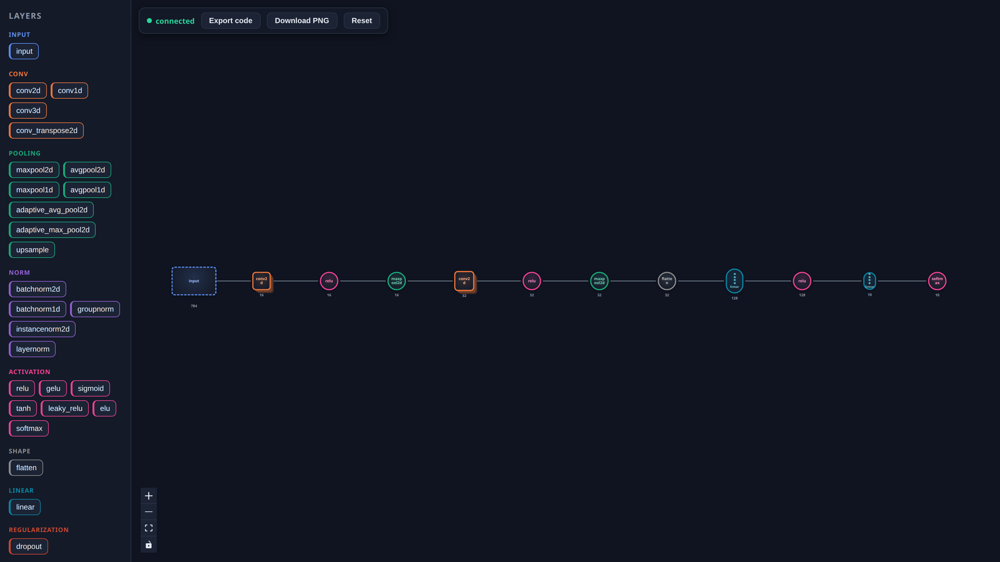
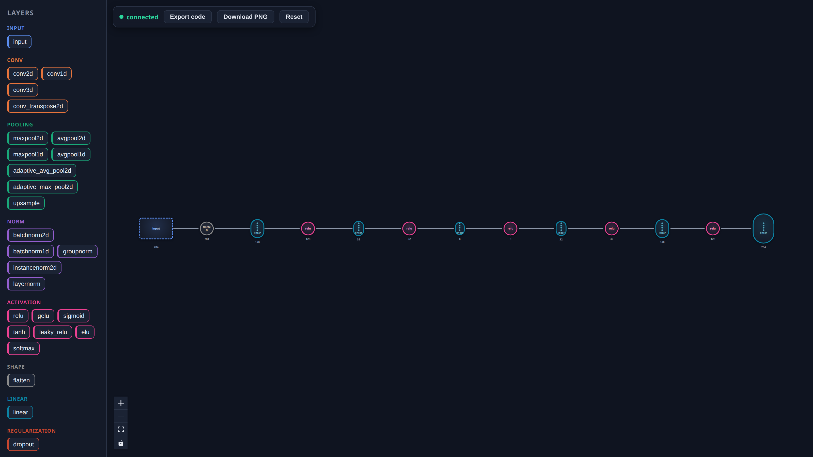
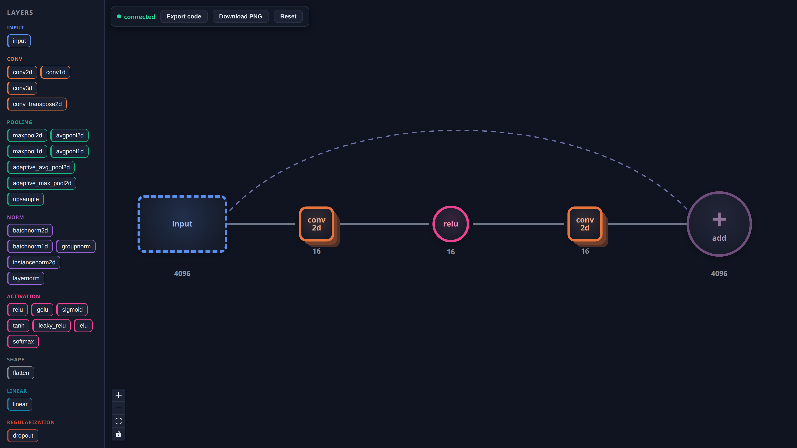
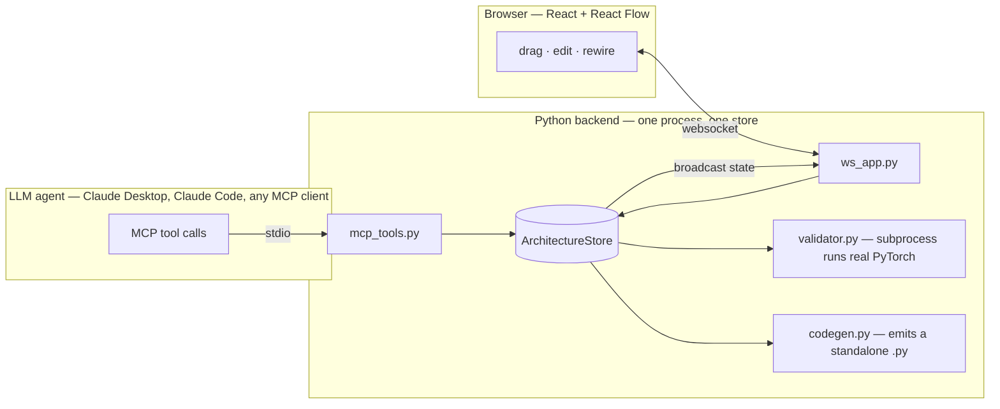

# nn-architect

**Collaborative, agent-driven neural-network design with live shape validation.**

An LLM agent designs a neural network by calling MCP tools. A human watches it
appear, node by node, on a browser canvas — and can grab the mouse and edit the
same graph at any time. The agent sees those edits the next time it looks. When
either side wants to know whether the architecture actually holds together, the
server *runs the generated PyTorch* against a dummy batch and reports the exact
node and layer where the shapes break.

It is not another drag-and-drop "export to PyTorch" toy. The point is the shared,
agent-editable graph and a validator that executes real code instead of guessing.



---

## Demo

<!-- Recording: agent builds a CNN over MCP while the canvas updates live. -->


Ask the agent for "a small CNN for 28×28 grayscale digits," and the layers land
on the canvas as the tool calls go out. Drag a node, change `out_channels`, delete
an edge — the agent picks it up on its next `get_architecture`. Either side can
hand control back to the other.

---

## Why it's built this way

Three decisions carry the whole project:

**One graph, two surfaces, one source of truth.** The MCP tools and the websocket
handler are both thin adapters over a single in-memory `ArchitectureStore`. There
is no second code path that mutates the graph, so the agent's view and the human's
canvas can't drift apart. Every successful edit — from either side — broadcasts the
new state to every connected browser.

**Shapes are checked by running the code, not by reading it.** `validate_architecture`
generates a self-contained PyTorch module, runs it in a subprocess against a fixed
dummy batch (N=2), and catches the failure at the layer that raised it. You get a
structured result, not a traceback:

```json
{
  "valid": false,
  "error": {
    "node_id": "n2",
    "layer_type": "conv2d",
    "message": "Given groups=1, weight of size [16, 3, 3, 3], expected input[2, 1, 28, 28] to have 3 channels, but got 1 channels instead"
  }
}
```

The subprocess is sandboxed two ways so a huge or pathological graph can't take the
host down: a pre-flight parameter estimate rejects oversized models before torch is
ever spawned, and the runner caps its own address space (`RLIMIT_AS`). The timeout
only guards against hangs; these guard against memory.

**The canvas reads the graph at a glance.** Node positions aren't stored — the
frontend lays the graph out left-to-right by distance from the input. Glyphs are
chosen per layer family (conv → stacked slab, linear → neuron column, attention →
block, merge → ⊕/∥ junction) and *sized by feature width*, so an autoencoder
visibly pinches to its latent and a residual skip is drawn as a dashed arc over the
columns it jumps.

|  |  |
|---|---|
|  |  |
| A dense autoencoder — the glyphs taper to the latent and back. | A residual block — the skip is a dashed arc into an `add` merge. |

---

## How it fits together



The backend runs as one process. Claude Desktop launches it over stdio for MCP;
the same process serves the websocket on `:8765`. Because they share the one store,
an agent tool call and a human mouse drag are the same kind of operation underneath.

### Seeing the agent work — guaranteed

The whole project is pointless if the human can't *see* the agent building. The
hard part in practice is stale processes: start a second backend (a new Claude
Desktop session, a leftover dev server) and you'd get two stores, with the browser
attached to the wrong one — edits vanishing into a graph nobody is watching.

So the newest backend **reclaims the canvas**. On startup it checks `:8765`, and if
a *previous nn-architect backend* still holds it, it terminates that instance and
takes over. The browser auto-reconnects and re-attaches to the live store. The
reclaim is deliberately narrow: it only ever stops a process it can positively
identify as one of its own (via a per-port pidfile and the process command line),
never an unrelated service on the port — for that it falls back to serving MCP only
and tells the agent, in every reply, that the canvas is unavailable. The result:
clone, run, and the canvas just shows what the agent is doing, without a process
hunt.

---

## Generated code is standalone

`generate_code` emits a single file that imports only `torch` and `math`. It inlines
its own error type (and a positional-encoding helper when the graph needs one), so
you can drop it into a fresh `.py` outside this repo and run it with nothing but
PyTorch installed:

```python
import torch
import torch.nn as nn


class GeneratedModel(nn.Module):
    def __init__(self):
        super().__init__()
        self.layer_n2 = nn.Flatten(start_dim=1)
        self.layer_n3 = nn.Linear(in_features=784, out_features=128)
        self.layer_n4 = nn.ReLU()
        self.layer_n5 = nn.Linear(in_features=128, out_features=10)

    def forward(self, x):
        outputs = {}
        outputs["n1"] = x
        outputs["n2"] = self.layer_n2(outputs["n1"])
        outputs["n3"] = self.layer_n3(outputs["n2"])
        outputs["n4"] = self.layer_n4(outputs["n3"])
        outputs["n5"] = self.layer_n5(outputs["n4"])
        return outputs["n5"]
```

(The real output wraps each layer in a `try/except` that raises the structured
`LayerExecutionError` above — trimmed here for readability.)

---

## Quick start

You need **Python 3.10+** (tested on 3.12), **Node 18+** (tested on 20), and an MCP
client such as Claude Desktop.

### 1. Backend

```bash
python -m venv .venv
# macOS / Linux:
source .venv/bin/activate
# Windows (PowerShell):
# .venv\Scripts\Activate.ps1

pip install -r backend/requirements.txt
```

`torch` is the heavy dependency; CPU wheels are fine, this never trains anything.

### 2. Frontend

```bash
cd frontend
npm install
npm run dev      # serves the canvas at http://localhost:5173
```

Point the UI at a non-default backend with `VITE_WS_URL` (e.g.
`VITE_WS_URL=ws://localhost:8799/ws npm run dev`).

### 3. Register the MCP server with Claude Desktop

Copy `claude_desktop_config.snippet.json` into your Claude Desktop config and fill
in the two absolute paths (your venv's Python, and `backend/main.py`):

```json
{
  "mcpServers": {
    "nn-architect": {
      "command": "/ABSOLUTE/PATH/TO/venv/bin/python",
      "args": ["/ABSOLUTE/PATH/TO/nn-architect/backend/main.py"]
    }
  }
}
```

On **Windows**, the command is your venv's `Scripts\python.exe` and paths use
backslashes, e.g. `"C:\\path\\to\\.venv\\Scripts\\python.exe"`.

The config file lives at:

| OS | Path |
|----|------|
| macOS | `~/Library/Application Support/Claude/claude_desktop_config.json` |
| Windows | `%APPDATA%\Claude\claude_desktop_config.json` |
| Linux | `~/.config/Claude/claude_desktop_config.json` |

Restart Claude Desktop, open the canvas in your browser, and ask it to build a
network. Layers appear as it calls the tools.

### Running the backend by hand

```bash
python backend/main.py                 # full: MCP over stdio + websocket on :8765
MODE=standalone python backend/main.py # websocket only, for frontend work
```

Environment knobs: `WS_PORT` (default 8765), `LOG_FILE` (default
`logs/nn_architect.log` — logs go to stderr and this file, never stdout),
`NN_VALIDATION_MAX_PARAMS` (default 500M), `NN_VALIDATION_MEM_MB` (default 4096).

---

## The agent's tools

Twelve MCP tools, each a thin wrapper over one store method. `get_catalog` is the
discovery surface — call it first and you get every layer type with its category,
required params, and optional params with defaults, so a cold agent never has to
guess. Errors are written to be acted on: an unknown type lists the known ones; a
missing-param error names *all* the missing params at once.

| Mutations | Reads |
|-----------|-------|
| `add_layer`, `add_layers` | `get_catalog` |
| `update_layer`, `remove_layer` | `get_architecture` |
| `connect_layers`, `connect_layers_batch` | `validate_architecture` |
| `disconnect_layers`, `reset_architecture` | `generate_code` |

`add_layers` and `connect_layers_batch` build an entire network in one atomic call
(all-or-nothing), so a 100-node model isn't hundreds of round-trips. Mutations
broadcast to the canvas; reads never do.

---

## Layer catalog

36 layer types across 12 categories — enough to build the major families end to end:

- **input** · **conv** (1/2/3d, transpose) · **pooling** (max/avg, adaptive, upsample)
- **norm** (batch/group/instance/layer) · **activation** (relu, gelu, sigmoid, tanh, leaky_relu, elu, softmax)
- **linear** · **shape** (flatten) · **regularization** (dropout) · **embedding**
- **recurrent** (rnn, lstm, gru) · **attention** (multihead, transformer-encoder layer, positional encoding)
- **merge** (`add`, `concat`)

Conventions are fixed so generated code is predictable: `batch_first=True`
everywhere, images are `(N, C, H, W)`, sequences are `(N, L, E)`, attention is
self-attention. Adding a layer is one schema entry plus one codegen mapping (and one
palette entry on the frontend).

---

## Repository layout

```
backend/
  main.py            entry point: store + MCP stdio + websocket, single canvas owner
  store.py           ArchitectureStore — the only place the graph is mutated
  mcp_tools.py       the 12 MCP tools (adapters over the store)
  ws_app.py          websocket server (adapters over the same store)
  layers.py          layer catalog: schemas, defaults, per-type validation
  codegen.py         graph → standalone PyTorch source
  validator.py       runs generated code in a sandboxed subprocess
  runner_template.py the subprocess runner
frontend/
  src/               React + React Flow canvas, palette, params panel
```

---

## Scope

This is a portfolio prototype. It designs architectures; it does not train them —
no optimizer, no datasets, no loss curves. Validation proves shapes line up under a
forward pass, nothing about whether the model is any good.

## Running the tests

```bash
# backend
cd backend && python -m pytest

# frontend
cd frontend && npm test
```
